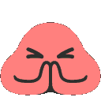

<h1 align="center">Hello, I'm Büşra 👋 </h1>
<h4 align="center"> 💻I am a Software Engineering student.</h4>
<h4 align="center">🌱 I'm trying to be Front End Developer.</h4>
<h4 align="center">
Technologies I Love
  
:blossom: React  
:blossom: Python  
:blossom: Machine Learning  
:blossom: Data Science 
:blossom: Frontend Web Development 
:blossom: Arduino 
</h4>
 

 

 

  <h4 align="center">   My most used languages :</h4>  

 
 
 

 <h4 align="center">  snake eating my contributions : </h4>
 

